# 红蜘蛛多媒体教室对抗器
图片在国内可能显示不出来。
## 1.使用方法
在上面的项目文件中，**打包**这个文件夹整个复制到本地，也可以在**Releases**里下载，不过版本肯定跟不上那么高。

下载完成之后，就可以点击打开**sidindex.exe**进行使用了。
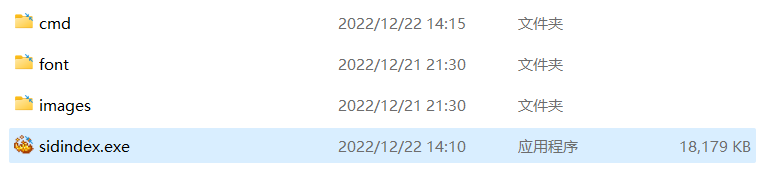

打开之后会看到这个软件，有置顶效果。
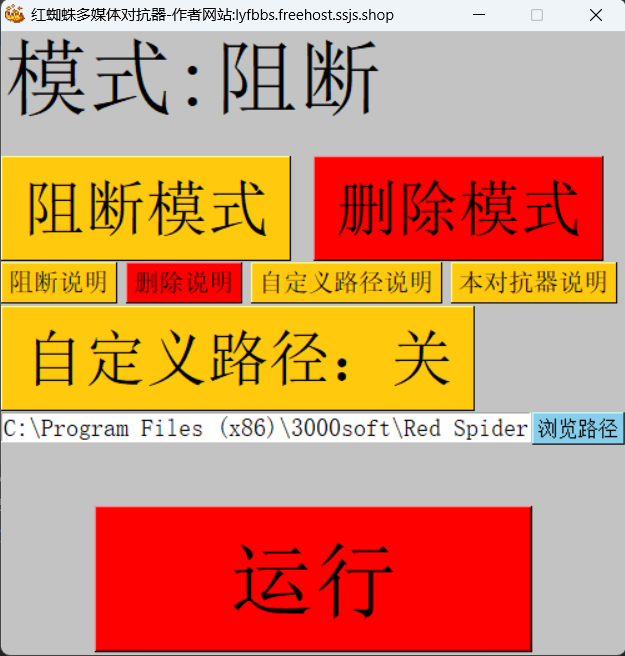
那么在没***被老师控制***的情况下我们是可以正常打开软件的，那么，要是被老师控制了呢？
我们可以利用Windows电脑内置的Xbox，大部分学校电脑应该都没有删除这个软件。

首先，我们按下键盘上的***Windows微标键***+_**G**_

打开了一个这个（初次打开可能需要等待几秒才能打开），由于是**微软的官方软件**，所有优先级比***红蜘蛛多媒体教室***高
。
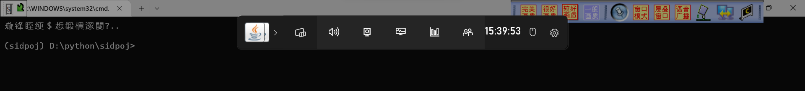

接下来我们点击这个，_**资源**_
这个可以说是Xbox内置的小型任务管理器。

好打开了，我们找到**REDAgent.exe**，然后点击结束任务，这样红蜘蛛就被关掉了，关掉之后我们正常打开对抗软件就可以了。
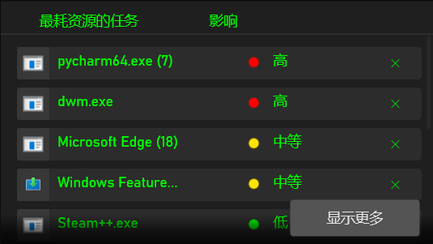
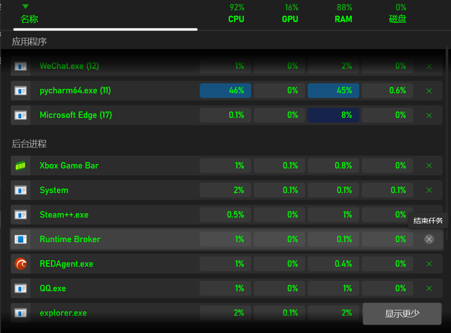
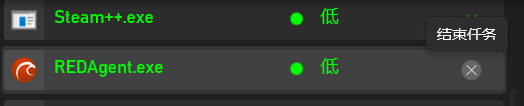
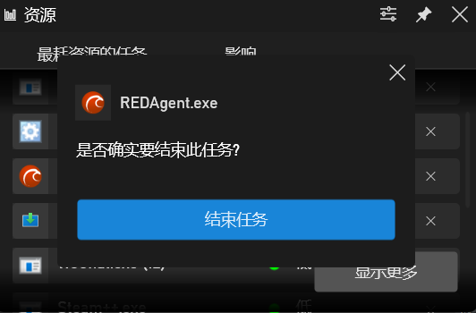

有几个基本功能，推荐使用阻断，点击运行后就可以执行命令了，通常打开软件后可以直接点击运行，默认配置很管用，会请求管理员权限，不然红蜘蛛删不掉。

## 获取红蜘蛛软件的位置
在老师未控制我们的情况下，按下键盘上的***Windows微标键***+**X**
。点击任务管理器。
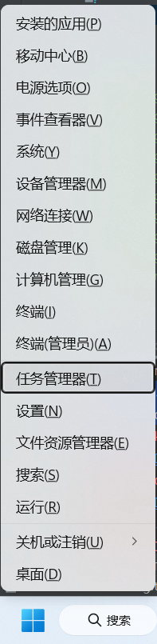

找到**REDAgent.exe**（或者***红蜘蛛多媒体教室网络软件***），右键单击，点击转到文件所在位置。
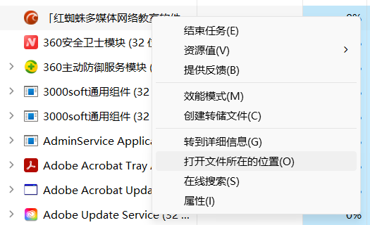
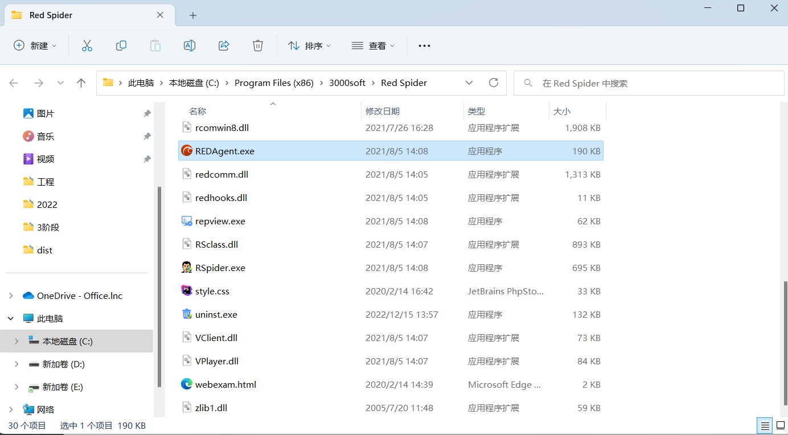
点击路径栏，复制内容，这个就是路径了。
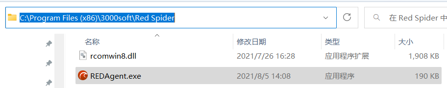
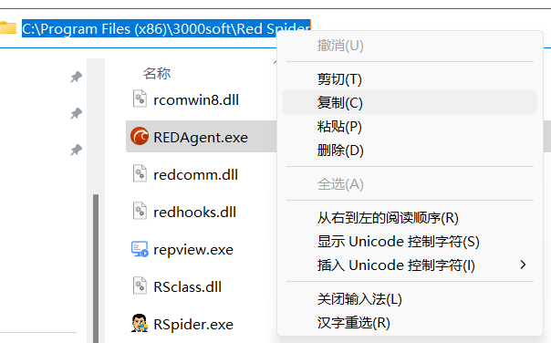